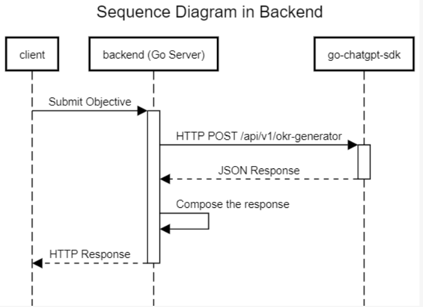

<div align="center">
    
    <h2>Backend (okr-generator)</h2>
</div>

### Prerequisite

- Go

### Getting Started

> How to run for development mode

```bash
# please add config, and suitable with your preference
cp .config.toml.example .config.toml
# or generate env with
go run . env-generator
cp .config.generated.toml .config.toml

# run the server
go run . server
```

> How to run with Docker

```bash
# generate env
go run . env-generator
# build docker image
docker build --build-arg HOST=localhost --build-arg PORT=3000 --build-arg VERSION=vx.x.x --build-arg ENV=production --build-arg TOKEN="" -t backend:latest .
# run the server
docker run -d -p <port_external>:<port_internal> --name <container_name> backend:latest
# check with
docker ps
```

> How to run with Docker Compose

```bash
cd ../
docker-compose up -d
```

> The configuration

> to generate env please run `go run . env-generator`

```toml
[app]
port = 3000
host = "localhost"
version = "vx.x.x"
env = "production"

[chatgpt]
token = ""
```
