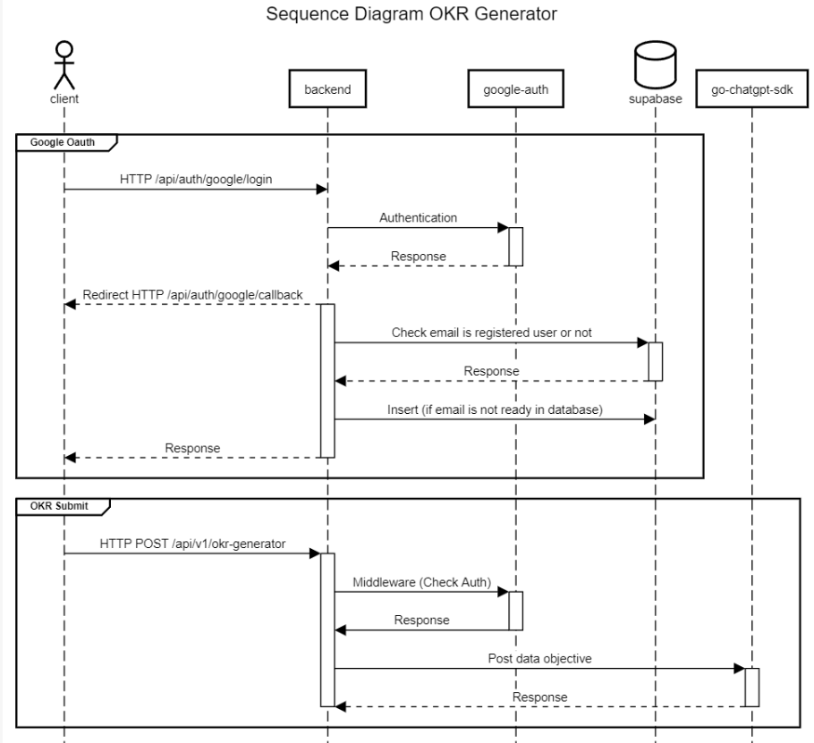

<div align="center">
    
    <h2>Backend (okr-generator)</h2>
</div>

### Prerequisite

- Go

### Getting Started

#### Commands

```bash
go run . <options>
```

| options       | description    |
| ------------- | -------------- |
| server        | run the server |
| env-generator | generate env   |

> How to run for development mode

```bash
# generate env
go run . env-generator
# copy r.config.generated.toml to .config.toml
cp .config.generated.toml .config.toml
# run the server
go run . server
```

> How to run with Docker

```bash
# build docker image
docker build --build-arg HOST=localhost --build-arg <env>=<value> -t backend:latest .
# run the server
docker run -d -p <port_external>:<port_internal> --name <container_name> backend:latest
# check with
docker ps
```

> How to run with Docker Compose

```bash
cd ../
docker-compose up -d
```

> The configuration

> to generate env please run `go run . env-generator`

```toml
[app]
port = 3000
host = "localhost"
version = "vx.x.x"
env = "production"

[chatgpt]
token = ""

[google]
client_id = ""
client_secret = ""
redirect_url = ""
auth_state = ""

[supabase]
url = ""
key = ""
```
